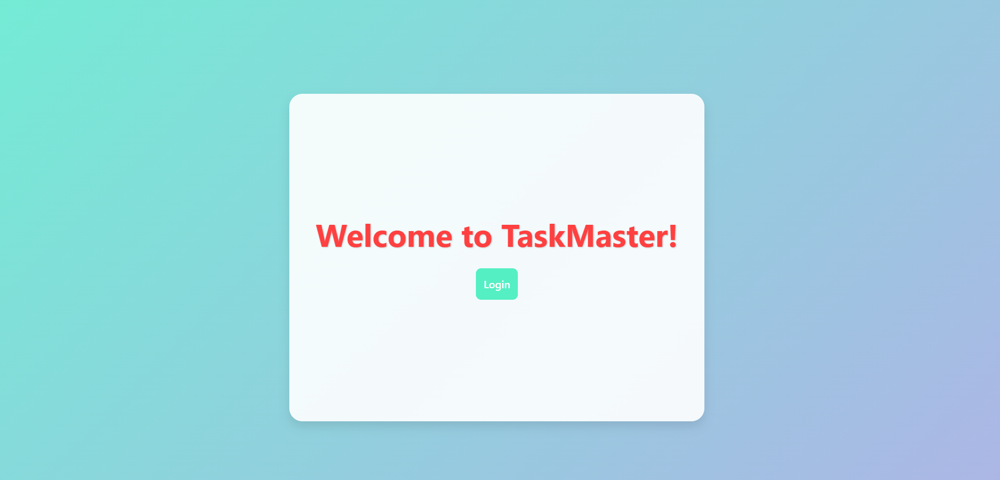
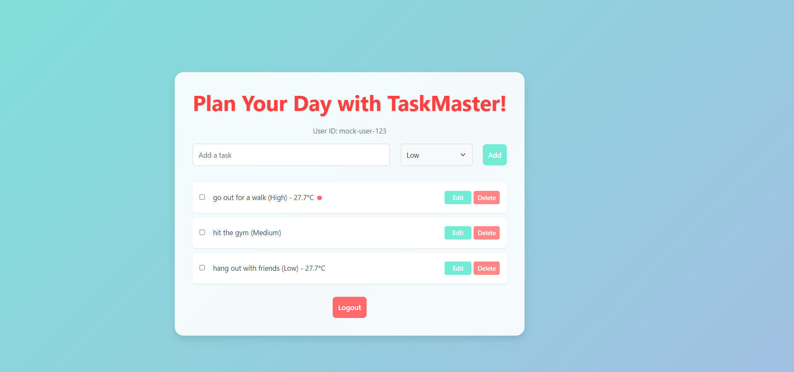
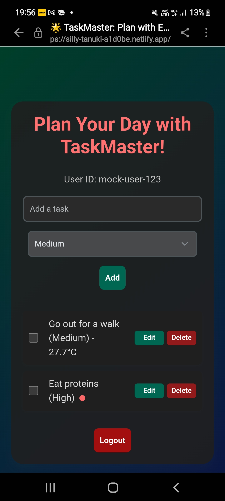

# React To-Do App

A feature-rich To-Do application built with React, Redux, and integrated with a weather API. This project was created as part of the QuadB Tech ReactJS Developer internship task.

## Overview
- **Task Management:** Add, edit, delete, and mark tasks as complete with priority levels (High, Medium, Low).
- **Weather Integration:** Displays current weather for outdoor tasks (using OpenWeatherMap API) for Bengaluru, India.
- **Authentication:** Mock login/logout system with persistence using Redux and localStorage.
- **Responsive Design:** Fully responsive across mobile, tablet, and desktop devices using CSS Flexbox.
- **State Management:** Utilizes Redux with Thunk for asynchronous API calls.
 
##screenshots
 ## Screenshots




## Installation
1. Clone the repository:
   ```bash
  https://github.com/sufiyaafreen2012/reactt-todo-app